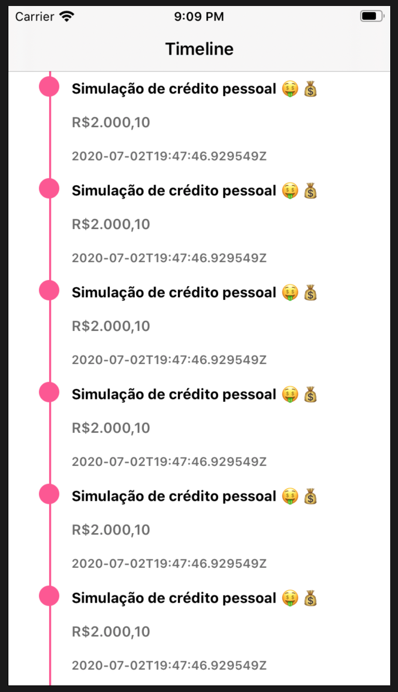

# BFF

Este projeto é uma  de um bff com beagle consumindo uma api de mock.

Estou utilizando o mock.io para simular uma chamada a um microserviço. 

## Postman 
Após rodar a aplicação você pode fazer um teste no postman para ver o que o beagle está retornando. Basta fazer um get na seguinte URL ``http://localhost:8080/loan/timeline/1?offset=-03:00``.

``
{
   "_beagleType_":"beagle:component:screencomponent",
   "identifier":null,
   "safeArea":null,
   "navigationBar":{
      "title":"Timeline",
      "showBackButton":true,
      "style":null,
      "navigationBarItems":null,
      "backButtonAccessibility":null
   },
   "child":{
      "_beagleType_":"beagle:component:scrollview",
      "children":[
         {
            "_beagleType_":"beagle:component:listview",
            "rows":[
               {
                  "_beagleType_":"custom:component:timelinewidget",
                  "description":"Simulação de crédito pessoal 🤑💰",
                  "value":"R$2.000,10",
                  "date":"2020-07-02T19:47:46.929549Z",
                  "id":null,
                  "flex":null,
                  "appearance":null,
                  "accessibility":null
               }
            ],
            "direction":"VERTICAL"
         }
      ],
      "scrollDirection":"VERTICAL",
      "scrollBarEnabled":null
   },
   "appearance":null,
   "screenAnalyticsEvent":null
}
``

Para ter uma visão completa de como funciona o beagle. Você pode rodar o projeto em iOS disponível nesse repositório https://github.com/mateusforgi/bff-ios.

O projeto iOS implementa o componente que o nosso BFF está dizendo que deve ser renderizado na tela. 
Neste exemplo o BFF está dizendo que a chamada para o nosso endpoint de timeline  vai retornar uma lista de componentes do tipo timelinewidget. Portando nosso projeto iOS vai ter que implementar esse componente para poder renderizar a tela, visto que esse é um componente não nativo no beagle. A imagem abaixo mostra a tela que foi renderizada.

## Demo

